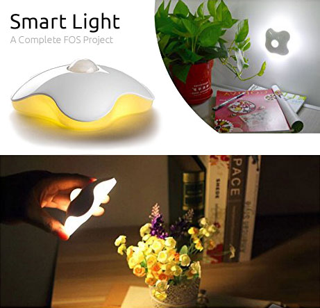
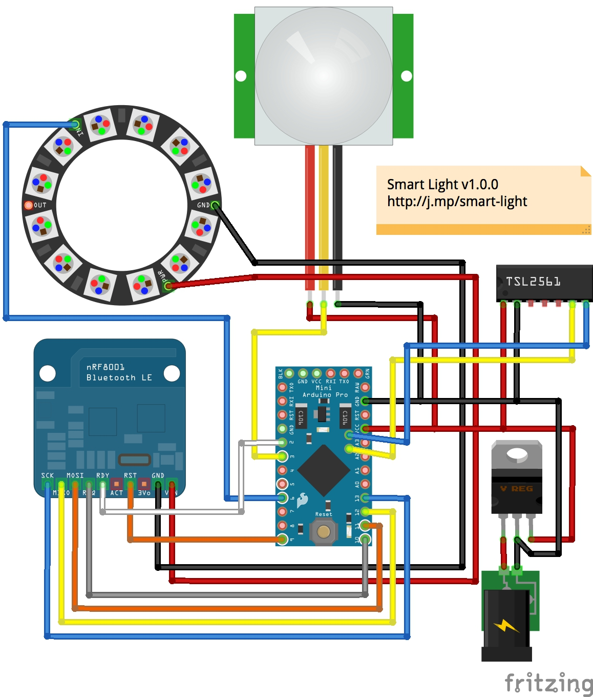

# Smart Light

#### Smart Light ( Arduino Sketch, Fritzing Schematic &amp; Mobile App )

Build your own Smart Light with this Complete FOS Project.  The completed project will allow you to use a free mobile application to control how &amp; when you want your Smart Light to work.  We are also releasing our Smart Light Mobile App as part of this project.

The main goal of this project is to show how anyone can build their own Custom Product from Start to Finish.  You now have with Custom Software, and even control that Product with a powerful Mobile Application.

Parts List
---

#### You will need to purchase the following hardware:

* [Arduino Pro Mini 328 - 5V/16 MHz](https://www.adafruit.com/products/2378?utm_medium=referral&utm_source=manifestinteractive)
* [PIR (motion) sensor](https://www.adafruit.com/products/189?utm_medium=referral&utm_source=manifestinteractive)
* [NeoPixel Ring - 12 x WS2812 5050 RGB LED with Integrated Drivers](https://www.adafruit.com/products/1643?utm_medium=referral&utm_source=manifestinteractive)
* [Adafruit TSL2561 Digital Luminosity/Lux/Light Sensor Breakout](https://www.adafruit.com/products/439?utm_medium=referral&utm_source=manifestinteractive)
* [Bluefruit LE - Bluetooth Low Energy (BLE 4.0) - nRF8001 Breakout - v1.0](https://www.adafruit.com/products/1697?utm_medium=referral&utm_source=manifestinteractive)
* [Mini DC/DC Step-Down (Buck) Converter - 5V @ 1A output - TSR12450](https://www.adafruit.com/products/1065?utm_medium=referral&utm_source=manifestinteractive)

#### Optional Parts:

* [FTDI Serial TTL-232 USB Cable](https://www.adafruit.com/products/70)
* [4 x AA Battery Holder with On/Off Switch](https://www.adafruit.com/products/830)

#### Optional Enclosure:

I found it was actually cheaper to just get an existing Motion Light and replace it's components with the list above.  This is the enclosure I went with for this project:

* [Hallomall™ Clover Style Night Lights](http://www.amazon.com/gp/product/B00MLW99MK)

Wiring Instructions
---

